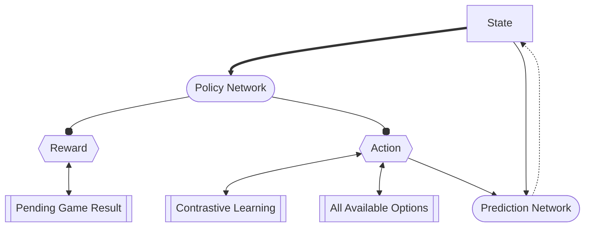

# Open Hearthstone
The OpenHearthstone is designed to be a robust data collection standard as well as a reinforcement learning incubator for research purposes. 

## Roadmap

The major roadmap for this repository is as follows.

- Data Standard Specification & Data S/L in `C#` and `Python`
- Data Collection with basic settings
- Implement a baseline RL-based deep learning network
  - Pretraining on text materials in game
  - Offline fully-supervised learning with human annotation
  - Online contrastive learning for continuous improvements

## Data Collection Specifications
### Game Saving
Core components for data storage is organized by game stored in separate files. For each game object, we use json structure to save the critical decision for each step.

```json
{
  "metadata": {
    "result": 1.0/-1.0, // WIN/LOSE
    "elapsed": 42627.0, // Elapsed miliseconds
    "total": 36,  // Total actions
    "deck": {
      "CARDID": COUNT,
      ...
    },
    "deck_name": "DECKNAME",
    "hero": HEROID,
    "format": FORMATID
  },
  "sequence": {
    // List of state, action and option pairs
    "state": [
      [
        // List of entities
        {
          "card_id": null,
          "card_name": "",
          "card_description": "",
          "tags": [
            "TAG": "VALUE"
          ]
        },
      ],
    ],
    "action": [
      {
        "type": ACTIONTYPE,
        "sub_option": SUBOPTIONID,  // Default -1
        "position": POSITION,
        "entity": ENTITYID,
        "target": TARGETID  // Default 0
      },
        ...
    ],
    "option": [
      [
        // All end effector options
        {
          "entity": ENTITYID,
          "type": ACTIONTYPE,
          "sub_options": [],
          "targets": [
            TARGETENTITYID,
            ...
          ]
        },
        ...
      ],
    ]
  }
}
```

### Data Definition

## Baseline Reinforcement Learning Pipeline Design

### Pretraining


### Offline Supervised Learning


### Online Contrastive Learning


