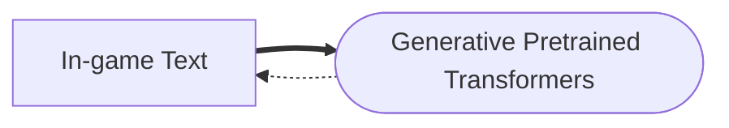
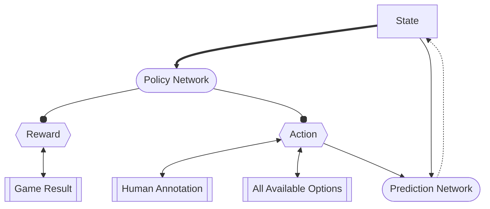

# Open Hearthstone
The OpenHearthstone is designed to be a robust data collection standard as well as a reinforcement learning incubator for research purposes. 

## Roadmap

The major roadmap for this repository is as follows.

- Data Standard Specification & Data S/L in `C#` and `Python`
- Data Collection with basic settings
- Implement a baseline RL-based deep learning network
  - Pretraining on text materials in game
  - Offline fully-supervised learning with human annotation
  - Online contrastive learning for continuous improvements

## Data Collection Specifications

## Baseline Reinforcement Learning Pipeline Design

### Pretraining

### Offline Supervised Learning

### Online Contrastive Learning

